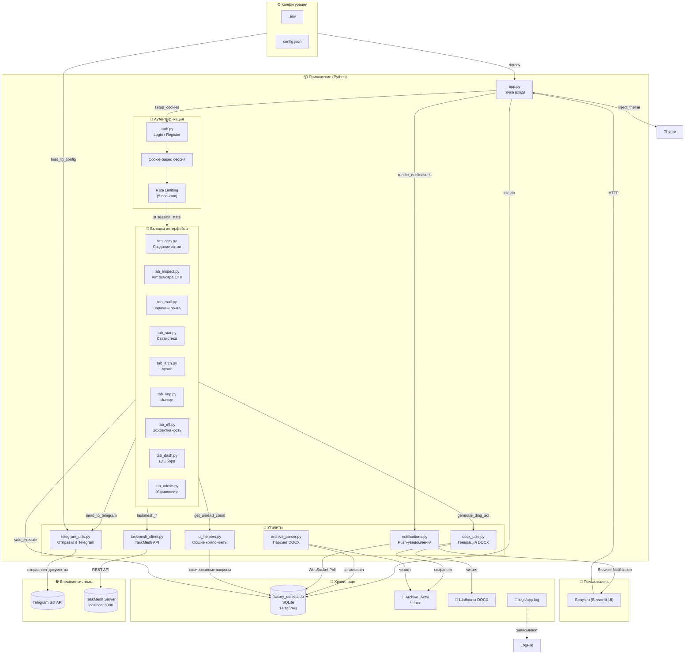

# Система учёта — Конструкторское бюро

⚠️ **Внимание: NDA (Соглашение о неразглашении)**

Данный репозиторий является портфолио-визиткой. Исходный код проекта является закрытым в связи с коммерческой тайной работодателя. В этом описании представлена архитектура проекта, используемый стек технологий, а также скриншоты пользовательского интерфейса (с использованием тестовых и обезличенных данных) исключительно для демонстрации моих компетенций как инженера-разработчика.

---

Корпоративное веб-приложение для учёта производственных дефектов, создания актов диагностики/утилизации/ОТК, отслеживания эффективности сотрудников и внутренних задач.

**Версия:** 1.2  
**Платформа:** Streamlit (Python)  
**База данных:** SQLite  
**Назначение:** учёт дефектов, генерация актов, аналитика эффективности, внутренние задачи и почта.

---

## Технологии

| Компонент | Библиотека |
|-----------|-----------|
| UI | Streamlit 1.35+ |
| База данных | sqlite3 |
| Работа с данными | pandas, openpyxl |
| DOCX | python-docx, docxtpl |
| Telegram API | requests |
| Аутентификация | bcrypt, hashlib |
| Окружение | python-dotenv |
| Логирование | logging (RotatingFileHandler) |
| Десктоп | pywebview, pywin32 |
| Сборка | PyInstaller |
| Установка | Inno Setup |

---

## Быстрый старт

```bash
pip install -r requirements.txt
streamlit run app.py
```

---

## Структура проекта

```text
app.py                      # Точка входа
config.py                   # Конфигурация (пути, .env)
database.py                 # Инициализация БД, утилиты (safe_execute, hash/verify)
auth.py                     # Аутентификация (cookies, bcrypt, rate-limit)
theme.py                    # Тёмная тема "Night Witch"
ui_helpers.py               # Общие UI-компоненты (кэшированные запросы, фильтры)
docx_utils.py               # Генерация DOCX из шаблонов
telegram_utils.py           # Отправка в Telegram
taskmesh_client.py          # HTTP-клиент TaskMesh (задачи/чаты)
notifications.py            # Push-уведомления в браузере
archive_parser.py           # Парсинг существующих DOCX-архивов
logging_config.py           # Централизованное логирование
launcher.py                 # Десктоп-загрузчик

tabs/                        # Вкладки интерфейса
  ├── tab_acts.py     📝 Создание актов
  ├── tab_inspect.py  📋 Акт осмотра ОТК
  ├── tab_mail.py     📌 Задачи и почта
  ├── tab_stat.py     📊 Статистика
  ├── tab_arch.py     📂 Архив
  ├── tab_imp.py      📥 Импорт актов
  ├── tab_eff.py      ⚡ Эффективность
  ├── tab_dash.py     🏠 Дашборд руководителя
  └── tab_admin.py    🔐 Управление доступом

АКТ_ОСМОТРА.docx            # Шаблон акта осмотра
АКТ_ОТК.docx                # Шаблон акта ОТК
АКТ_УТИЛИЗАЦИИ.docx         # Шаблон акта утилизации

Archive_Acts/               # Сгенерированные акты
Эффективность/              # Excel-шаблоны эффективности
DB_Archive_*/               # Архивы БД
logs/                       # Логи приложения

config.json                 # Telegram-конфиг (легаси)
.env                        # Переменные окружения
requirements.txt            # Зависимости
launcher_config.json        # Конфиг загрузчика

logo.png / icon.png / logo.ico
OTK_Groznye_Pticy.exe       # Собранный exe
installer.iss               # Inno Setup скрипт
*.bat                       # Скрипты сборки/установки
```

---

## Схема работы приложения (Mermaid)



## Данные

### База данных (SQLite)

14 таблиц: `departments`, `users`, `employees`, `defect_logs`, `defect_items`, `util_logs`, `util_items`, `inspection_logs`, `operations`, `work_log`, `messages`, `room_keys`, `tasks`, `task_comments`.

Связи:
- `defect_logs` → `defect_items` (один ко многим)
- `defect_logs` → `inspection_logs` (связь по `parent_log_id`)
- `util_logs` → `util_items` (один ко многим)
- Все логи привязаны к `departments` и `employees`

---

## Пользователи и роли

| Роль | Доступ |
|------|--------|
| `superadmin` | Полный доступ, включая управление пользователями |
| `manager` | Всё, кроме админ-панели |
| `employee` | Всё, кроме админ-панели и ОТК-проверки |
| `otk` / `otk_vedma` | Полный доступ + вкладка актов осмотра ОТК |

---

## Функциональность

### Акты (3 типа)

| Акт | Шаблон | Описание |
|-----|--------|----------|
| **Осмотра (диагностика)** | `АКТ_ОСМОТРА.docx` | Фиксация дефекта: артикул, наименование, ответственный, решение |
| **ОТК** | `АКТ_ОТК.docx` | Проверка ОТК: вердикт (проверено/отремонтировано/брак/утиль/готово) |
| **Утилизации** | `АКТ_УТИЛИЗАЦИИ.docx` | Списание: причина, заключение |

### Внутренние модули
- **Задачи** — доска задач с приоритетами, статусами, дедлайнами, комментариями
- **Почта** — внутренние сообщения между отделами, привязка к актам
- **Статистика** — аналитика дефектов, утилизации, графики, генерация отчётов DOCX
- **Эффективность** — учёт операций, нормо-часы, расчёт KPI, отчёты в Telegram
- **Дашборд руководителя** — сотрудники, сводка по отделу, ежедневный отчёт, учёт ключей
- **Импорт** — ручной ввод актов, пакетный импорт CSV/Excel/из архива DOCX
- **Архив** — просмотр/скачивание/отправка сгенерированных актов

---

## Пользовательский интерфейс


